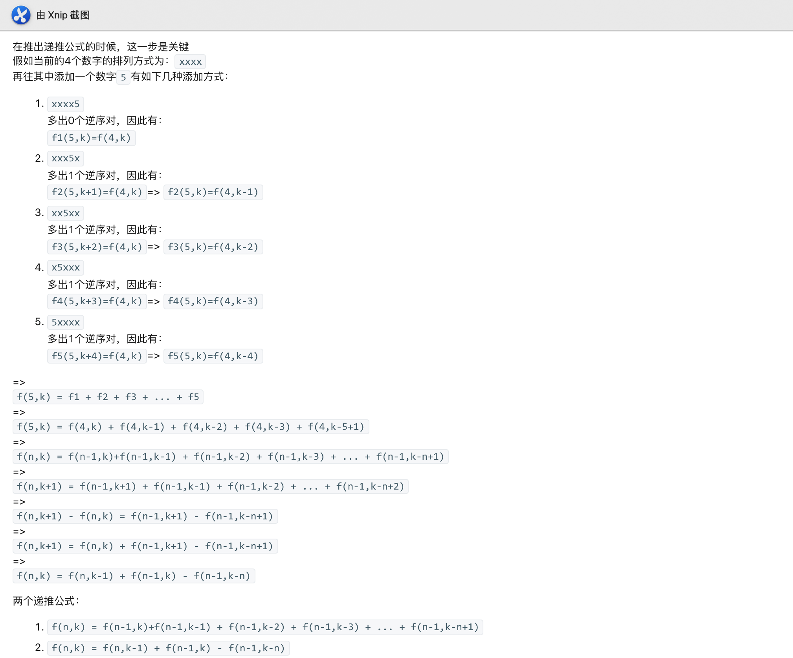

# My Answer
```c++
class Solution {
public:
    int kInversePairs(int n, int k) {
        int M = pow(10, 9)+7;
        vector<vector<int>> dp(n+1,vector<int>(k+1,0));
        for(int i = 1;i<n+1;i++){
            dp[i][0] = 1;
        }
        for(int i = 1;i<k+1;i++){
            dp[1][k] = 0;
        }
        for(int i = 2;i<n+1;i++){
            for(int j=1;j<k+1;j++){
                if(j-i>=0){
                    dp[i][j] = (dp[i][j-1]-dp[i-1][j-i]+dp[i-1][j])%M;
                    if(dp[i][j]<0){
                        dp[i][j]+=M;
                    }
                }else{
                    dp[i][j] = (dp[i][j-1]+dp[i-1][j])%M;
                }
            }
        }
        return dp[n][k];
    }
};
```
# Explanation


# Conclusion